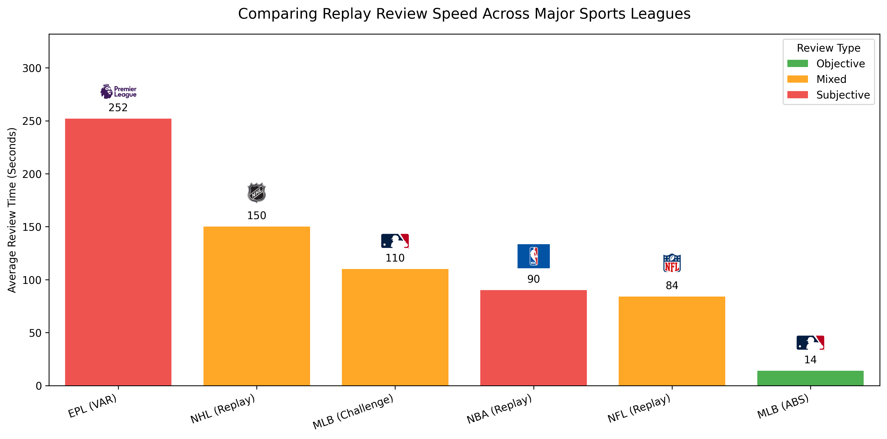
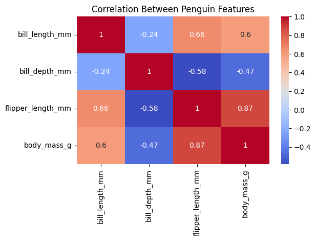

# Jaden Boothe - Data Portfolio

## Tech Stack

  

  

  
  
  
  
  

Welcome to my Data Science Portfolio! This repository showcases my projects in data analysis, visualization, and sports analytics. Here, you will find a collection of work that demonstrates my ability to clean data, analyze trends, and communicate insights clearly.

## Table of Contents
- [About Me](#about-me)
- [Project 1: ABS vs Replay Analysis](#project-1-abs-vs-replay-analysis)
- [Project 2: Palmer Penguins Analysis](#project-2-palmer-penguins-analysis)
- [Project 3: Titanic Survival Analysis](#project-3-titanic-survival-analysis)

---

## About Me

I’m a Data Science student at Penn State University with a strong interest in data analysis, visualization, and sports analytics. My background in customer-facing roles has helped me build strong communication, problem-solving, and decision-making skills that I bring into technical projects. I enjoy using data to uncover trends, tell clear stories, and support smarter decisions.

---

## Project 1: ABS vs Replay Analysis

**Tools Used:** Python, Pandas, Matplotlib, Jupyter Notebook

This project compares challenge and replay systems across major sports leagues, focusing on review speed, subjectivity, and efficiency. The goal is to evaluate whether automated systems like MLB ABS create a better fan experience than slower, more subjective review systems.

### Key Highlights
- Compared review times across multiple leagues
- Evaluated the role of automation vs subjectivity
- Built visualizations to communicate differences clearly

### Project Preview

**Repository Link:** [ABS vs Replay Analysis](https://github.com/Jay330-creator/abs-replay-analysis)

---

## Project 2: Palmer Penguins Analysis

**Tools Used:** Python, Pandas, Matplotlib, Seaborn, Jupyter Notebook

This project explores the Palmer Penguins dataset to identify species differences through body measurements, flipper length, and bill dimensions. It focuses on data cleaning, exploratory data analysis, and visual storytelling.

### Key Highlights
- Cleaned and explored biological measurement data
- Compared penguin species using summary statistics and visualizations
- Identified patterns across multiple physical features

### Project Preview

**Repository Link:** [Palmer Penguins Analysis](https://github.com/Jay330-creator/penguins-data-analysis-python)

---

## Project 3: Titanic Survival Analysis

**Tools Used:** Python, Pandas, Matplotlib, Seaborn, Jupyter Notebook

This project analyzes passenger survival patterns from the Titanic dataset. The focus is on how factors such as class, age, gender, and fare related to survival outcomes.

### Key Highlights
- Explored survival rates across passenger groups
- Visualized relationships between class, fare, and survival
- Practiced data cleaning and exploratory analysis techniques

### Project Preview

**Repository Link:** [Titanic Survival Analysis](https://github.com/Jay330-creator/titanic-survival-eda-python)
