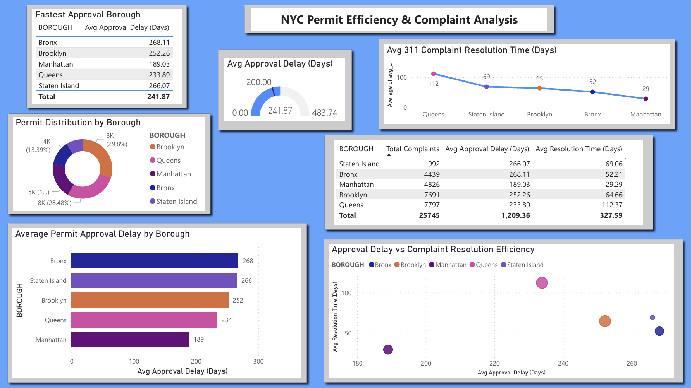

# Jaden Boothe — Data Portfolio

## Tech Stack

  

  

  
  
  
  
  

I'm a 3rd-year Data Science student at Penn State who builds end-to-end analytics projects. Each project below frames a real business problem, walks through how I approached the data, and ends with insights I'd actually be able to defend in front of a stakeholder.

I focus on the parts that matter most in industry: cleaning messy real-world data, asking the right business question, and translating findings into language a non-technical decision-maker can use.

---

## Table of Contents

* [About Me](#about-me)
* [Project 1: AI Sports Betting Agent + Live Performance Dashboard](#project-1-ai-sports-betting-agent--live-performance-dashboard)
* [Project 2: NYC Permits & 311 Service Efficiency Analysis](#project-2-nyc-permits--311-service-efficiency-analysis)
* [Project 3: NYC Transit Accessibility Analysis](#project-3-nyc-transit-accessibility-analysis)
* [Project 4: Sports Betting Performance Dashboard (Prototype)](#project-4-sports-betting-performance-dashboard-prototype)
* [Project 5: Titanic Survival Analysis](#project-5-titanic-survival-analysis)
* [Project 6: Palmer Penguins Analysis](#project-6-palmer-penguins-analysis)
* [Project 7: ABS vs Replay Analysis](#project-7-abs-vs-replay-analysis)

---

## About Me

I'm a Data Science student at Penn State University focused on data analysis, visualization, and sports analytics. My background in customer-facing roles taught me how to translate complex information into clear, actionable insights — a skill I now bring to every technical project. I care less about which tool I use and more about whether the analysis actually answers the question someone is paying me to answer.

---

## Project 1: AI Sports Betting Agent + Live Performance Dashboard

> **End-to-end case study.** This is the project I'd walk through in an interview.

### The Business Problem
Anyone running an automated decision-making system — whether it's a sports betting agent, a trading bot, or a recommendation engine — faces two questions executives always ask: *Is it actually working?* and *Is it worth what it costs to run?* Most analytics tools answer one or the other. I wanted to prove I could build a system that answers both, in real time, with full traceability from each decision back to its compute cost.

### The Question I Answered
**Is an AI agent's picks-per-dollar ROI good enough to justify keeping it running?**

To answer that I needed three connected layers of data: what the agent picked, whether it won, and what it cost to think about each pick.

### My Approach
- **Designed the data model first.** Built a 5-table Postgres schema in Supabase with foreign-key relationships so every pick is traceable to its source AI run, its cost row, and its grading result. Used Row Level Security so the public dashboard reads safely from the same tables that the agent writes to.
- **Solved the timing problem.** The agent generates picks at 1 PM but the run-cost data isn't available until ~30 seconds after. I built a two-stage attribution flow: producer stamps a run identifier; cost sync attributes tokens later within a 60-second tolerance window. This decouples enrichment from LLM completion timing.
- **Cut runtime cost by 85% with one architectural decision.** Originally every cron job ran through the LLM, even simple sync jobs that just moved data. I migrated deterministic ETL jobs to macOS launchd (no LLM in the loop) and kept only judgment-requiring jobs on the AI runtime. Daily cost dropped from ~$1.71 to ~$0.30.
- **Replaced fragile scraping with a proper data source.** The first version of grading scraped game scores from search engine HTML, which produced garbage results (regex was matching dates as scores). Replaced with ESPN's public API, then wrote multi-bet-type grading logic for moneylines, spreads, and totals.
- **Built the dashboard recruiters actually look at.** React + TypeScript, 5 pages, with a dedicated Costs page showing the metric I cared most about: **ROI on compute (units of profit earned per dollar of AI spend).**

### Key Findings 
- Higher-confidence "best" picks outperformed "secondary" picks by **25 percentage points** (75% vs 50% hit rate). The agent's confidence signal carries real information.
- One prompt rewrite cut preview-generation cost by **79%**. Prompt engineering isn't just about quality — it's a material cost lever.
- The agent's economics: **+4.47 units of profit per dollar of AI spend** over the initial sample. Not a recommendation, but a real, defensible number.

### Why It Matters
This is the question every team running AI in production will face this year: *what's the unit economics of an autonomous system?* Most analytics dashboards stop at "did it win or lose." This one tracks compute cost down to each individual decision, which is what makes the ROI calculation honest.

### Tools
Python, JavaScript, React, TypeScript, Node.js, Supabase (Postgres), OpenAI API, Tailwind, Recharts, macOS launchd, ESPN public API.

### Project Preview

**Repository:** [Insights Betting Dashboard](https://github.com/Jay330-creator/insights-betting-dashboard)

---

## Project 2: NYC Permits & 311 Service Efficiency Analysis

### The Business Problem
City agencies are under constant pressure to respond to permit requests and 311 complaints faster. But "faster" is a vague target — different complaint types have wildly different baselines, and without category-level visibility, leadership can't tell whether slow response times are a real operational problem or just normal variance. I framed this analysis as if I were presenting to a city operations team trying to decide *where to invest in process improvement.*

### The Question I Answered
**Which complaint and permit categories are dragging down overall service efficiency, and where would operational investment have the biggest impact?**

### My Approach
- **Cleaned two messy public datasets.** NYC's open data has inconsistent timestamps, missing close dates, and category labels that drift over time. Used Pandas to standardize timestamps and reconcile category labels across the two sources.
- **Aggregated with SQL** to surface response-time distributions per category, not just averages — averages hide the long tail where the real bottlenecks live.
- **Built a Power BI dashboard** organized around the question above, not just charts for the sake of charts. Every visual answers something a city ops leader would actually ask.

### Key Findings 
- Response time varies by **multiple times** between the fastest and slowest complaint categories, even after controlling for borough.
- Some categories have steady performance (high mean, low variance) while others have wild swings — these need different operational solutions.
- The data shows clear bottlenecks where response time spikes consistently, which would be the highest-leverage targets for process improvement.

### Why It Matters
A city ops leader looking at this dashboard could decide where to allocate inspector hours next quarter, or which agency partnerships need re-negotiation. Without category-level visibility, those decisions get made on gut feel.

### Tools
Python, Pandas, SQL, Power BI.

### Project Preview

**Repository:** [NYC Permits & 311 Service Efficiency Analysis](https://github.com/Jay330-creator/nyc-permits-311-service-efficiency-analysis)

---

## Project 3: NYC Transit Accessibility Analysis

### The Business Problem
The MTA reports ADA compliance rates publicly, but compliance and *real-world accessibility* aren't the same thing — a station can technically be ADA-compliant while still being unusable for someone in a wheelchair on a day when the elevator is broken. For a disability advocacy group or city planner trying to identify the actual mobility gap, the headline compliance number is misleading.

### The Question I Answered
**Where is NYC subway accessibility actually failing, and how strongly does it diverge from the official ADA compliance rate?**

### My Approach
- **Joined three different MTA datasets** (stations, entrances, elevators) using Python — each had its own inconsistencies in station identifiers, so reconciliation was non-trivial.
- **Wrote SQL to aggregate accessibility metrics at the borough level** so I could compare equity of access across the city, not just citywide totals.
- **Calculated correlation between ADA compliance and real accessibility** to test whether the official metric is a reliable proxy.
- **Built a Power BI dashboard** so a non-technical stakeholder could explore the borough-by-borough story without needing me there to interpret it.

### Key Findings 
- Only about **one in three** NYC subway stations is fully accessible.
- Manhattan has the highest accessibility rate; outer boroughs lag significantly.
- I found a **-0.713 correlation between ADA compliance and real-world accessibility**. Stations that are compliant on paper aren't necessarily accessible in practice — meaning the city's headline metric is misleading and likely overstating the true coverage.

### Why It Matters
For an advocacy group or city planner, this is the difference between "we're already doing well" and "we have a measurement problem hiding the real gap." The negative correlation finding is the kind of insight that would change how a stakeholder reports progress to the public.

### Tools
Python, SQL, Power BI, Pandas.

### Project Preview

**Repository:** [NYC Transit Accessibility Analysis](https://github.com/Jay330-creator/nyc-transit-accessibility-analysis)

---

## Project 4: Sports Betting Performance Dashboard (Prototype)

> **Note:** This was the prototype that evolved into [Project 1](#project-1-ai-sports-betting-agent--live-performance-dashboard). The original analyzed historical data; the new system generates picks autonomously and tracks costs in real time.

### The Business Problem
Most sports bettors track wins and losses in a notebook or spreadsheet, then use that to decide whether they should keep betting the same way. The problem: gut-feel pattern recognition is famously unreliable, and bettors usually can't tell whether a recent losing streak is bad luck or a real sign that a strategy stopped working. I framed this as if I were building a tool for a serious recreational bettor who wants to evaluate their own performance objectively.

### The Question I Answered
**Which sports and bet types are actually profitable over a meaningful sample, and which ones look profitable on instinct but lose money once you control for sample size?**

### My Approach
- **Built a SQLite database** from raw bet history and used SQL to aggregate by sport, bet type, and odds range — the cuts that actually matter for evaluating a betting strategy.
- **Calculated true profitability** (units net, not just W/L count) so the analysis reflects the real economic outcome, not just how often a bet won.
- **Built a Tableau dashboard** structured the same way I'd want to analyze my own betting: filter by sport → drill into bet types → see whether the sample is large enough to trust the signal.

### Key Findings 
- Profitability varies meaningfully across sports — some that "feel" profitable have negative returns once measured, and vice versa.
- Bet type matters more than sport for win-rate variance. Certain markets (e.g., player props) carry much higher volatility than others.
- Without structured tracking, bettors significantly overestimate their performance. Data discipline is the single biggest edge.

### Why It Matters
This is the kind of dashboard a serious bettor would use to *stop themselves* from making the same mistake twice. The follow-on project (Project 1) takes this idea and automates everything: real-time generation, automated grading, and per-decision cost tracking.

### Tools
SQL (SQLite), Tableau, Excel.

### Project Preview

**Repository:** [Sports Betting Analytics Dashboard](https://github.com/Jay330-creator/sports-betting-analytics)

---

## Project 5: Titanic Survival Analysis

### The Business Problem
Imagine you're an insurance analyst trying to understand the risk profile of historical maritime disasters, or a researcher studying how social class influenced outcomes in early 20th-century crises. The Titanic dataset is a small, complete record of one such event — clean enough to learn from, complex enough to reveal real patterns about how demographics and economic class affect survival.

### The Question I Answered
**Which factors — class, gender, age, or fare paid — most strongly predicted a passenger's chance of surviving the Titanic disaster, and what does that tell us about how social structure influenced outcomes in a crisis?**

### My Approach
- **Cleaned passenger data** (missing ages, inconsistent cabin codes, fare anomalies) using Pandas before any analysis — a step that's often skipped in beginner Titanic analyses, but matters for downstream conclusions.
- **Tested hypotheses individually**: did class matter independently of fare? Was the gender effect consistent across classes? Used grouping and crosstabs rather than jumping to a model.
- **Visualized survival rates across each variable** with Matplotlib and Seaborn to make the patterns interpretable to a non-technical reader.

### Key Findings 
- **Class was the single largest predictor** — first-class passengers survived at dramatically higher rates than third-class.
- **Gender effect was very strong** — women survived at roughly 3x the rate of men, and the effect held even within the same class.
- **Higher fare was associated with higher survival**, but most of that effect is explained by class — fare isn't an independent driver.

### Why It Matters
The Titanic story is often told as a tragedy of nature, but the data shows it was also a tragedy of social structure. Survival was strongly stratified by class and gender — a finding that has direct parallels to how modern crises (pandemics, natural disasters) disproportionately affect people based on socioeconomic factors.

### Tools
Python, Pandas, Matplotlib, Seaborn, Jupyter Notebook.

### Project Preview

**Repository:** [Titanic Survival Analysis](https://github.com/Jay330-creator/titanic-survival-eda-python)

---

## Project 6: Palmer Penguins Analysis

### The Business Problem
Wildlife researchers studying penguin populations need a fast way to differentiate species in the field, especially when traditional identification (visual markers) is ambiguous due to lighting, distance, or hybrid populations. Biological measurements are easier to collect reliably than visual ID, but only useful if specific measurements actually separate the species cleanly. I framed this analysis as if I were preparing a quick reference for a field researcher who needs to know *which two measurements would let them identify a penguin species fastest.*

### The Question I Answered
**Which physical measurements provide the cleanest separation between penguin species, and how confidently can species be predicted from those measurements alone?**

### My Approach
- **Cleaned the dataset** (removed null rows, standardized units) to ensure each comparison was apples-to-apples.
- **Compared every pair of biological measurements** to find the combination that best separates species visually.
- **Built scatter plots and pair plots** to show clustering directly — when you can see the species form clean clusters with two measurements, that's the field researcher's answer.

### Key Findings 
- **Flipper length and body mass together** create the cleanest species separation — most penguins can be classified with just these two measurements.
- Some species show very tight clustering (low within-species variance) while others overlap, meaning some species are easier to ID confidently than others.
- Visual exploration revealed patterns that summary statistics alone would have missed.

### Why It Matters
For a field researcher, this answers a practical question: *if I can only collect two measurements quickly, which two should they be?* The two-measurement rule from this analysis would let them classify most penguins in the field with high confidence.

### Tools
Python, Pandas, Matplotlib, Seaborn, Jupyter Notebook.

### Project Preview

**Repository:** [Palmer Penguins Analysis](https://github.com/Jay330-creator/penguins-data-analysis-python)

---

## Project 7: ABS vs Replay Analysis

### The Business Problem
Sports leagues are evaluating whether to replace human review systems with automated ones (like MLB's Automated Ball-Strike system). The decision has real economic stakes — broadcast pacing, fan retention, and umpire labor cost all sit on the answer. League officials and broadcasters need objective evidence comparing review duration and consistency between automated and human systems before committing to a transition.

### The Question I Answered
**Are automated review systems measurably faster and more consistent than human-based replay systems, and is the difference large enough to justify a structural change to officiating?**

### My Approach
- **Collected review-time data** across multiple sports leagues to compare automated and human-based decision systems on the same metric.
- **Compared distributions, not just averages** — a system that's faster on average but wildly inconsistent is worse for broadcasts than a slower but predictable one.
- **Visualized timing patterns** to show how the variance spread differs between automated and human review.

### Key Findings 
- Automated systems are **significantly faster** than human-driven replay systems on the same play types.
- Human-based reviews show much higher variance — the worst-case review times can be many times the median, which disrupts broadcast flow.
- Speed *and* consistency together drive fan experience. An automated system wins on both dimensions.

### Why It Matters
For a league weighing this transition, the consistency finding is arguably more important than the speed finding. Broadcasters can plan around a slow-but-predictable review window; an unpredictable one is a much bigger production problem. The data supports moving to automated review on operational grounds, not just speed.

### Tools
Python, Pandas, Matplotlib, Jupyter Notebook.

### Project Preview

**Repository:** [ABS vs Replay Analysis](https://github.com/Jay330-creator/abs-replay-analysis)

---

## 📫 Contact

* Email: jaden.n.boothe@gmail.com  
* LinkedIn: https://www.linkedin.com/in/jaden-boothe-29b8873b9/  
* GitHub: https://github.com/Jay330-creator  

Open to data analyst internship conversations for Summer 2026.
